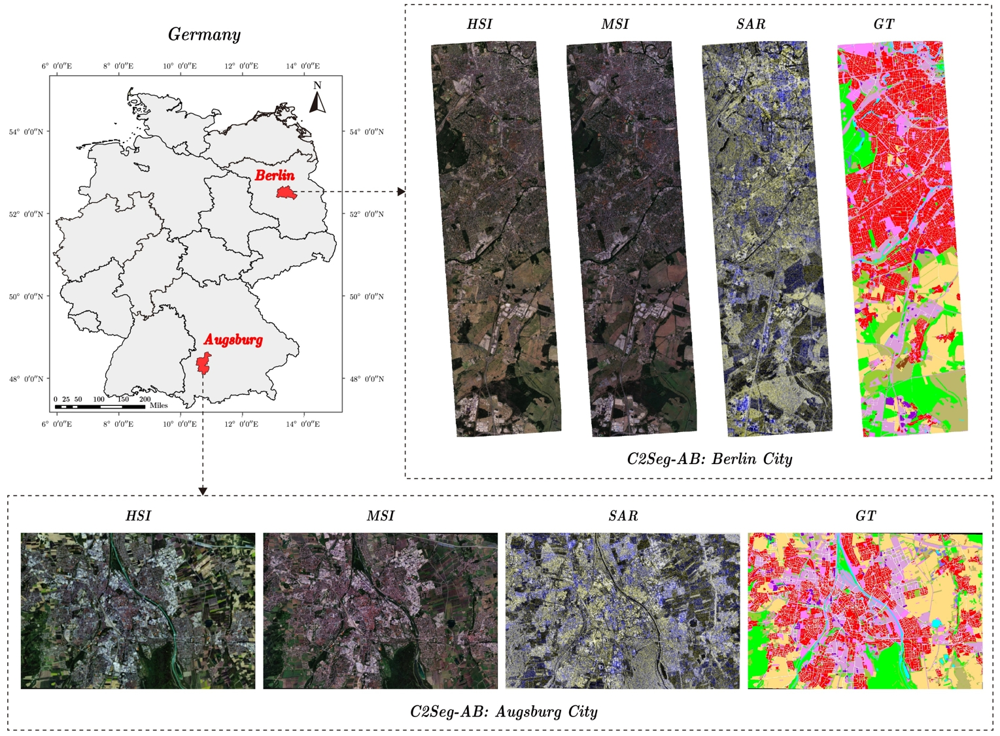
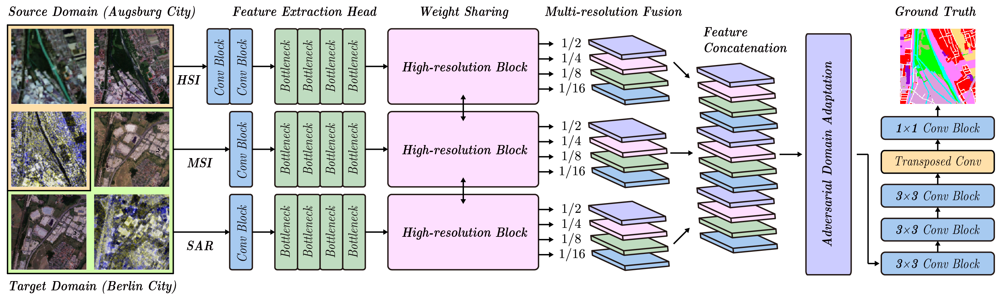

# Cross-City Matters: A Multimodal Remote Sensing Benchmark Dataset for Cross-City Semantic Segmentation using High-Resolution Domain Adaptation Networks

Danfeng Hong, Bing Zhang, Hao Li, Yuxuan Li, Jing Yao, Chenyu Li, Martin Werner, Jocelyn Chanussot, Alexander Zipf, Xiao Xiang Zhu

___________

The code in this toolbox implements the ["Cross-City Matters: A Multimodal Remote Sensing Benchmark Dataset for Cross-City Semantic Segmentation using High-Resolution Domain Adaptation Networks"](https://www.sciencedirect.com/science/article/abs/pii/S0034425723004078). A new set of multimodal RS benchmark datasets (C2Seg) is built for the study purpose of the cross-city semantic segmentation task. The C2Seg datasets can also be used for organizing the  ["WHISPERS2023 Challenge 1: CROSS-CITY MULTIMODAL SEMANTIC SEGMENTATION CHALLENGE"](https://www.ieee-whispers.com/cross-city-challenge/).

A high-resolution domain adaptation network utilizing adversarial learning (HighDAN) is devised to tackle this task.

Citation
---------------------

**Please kindly cite the papers if this code is useful and helpful for your research.**

Danfeng Hong, Bing Zhang, Hao Li, Yuxuan Li, Jing Yao, Chenyu Li, Martin Werner, Jocelyn Chanussot, Alexander Zipf, Xiao Xiang Zhu. Cross-City Matters: A Multimodal Remote Sensing Benchmark Dataset for Cross-City Semantic Segmentation using High-Resolution Domain Adaptation Networks. Remote Sensing of Environment, 2023, 299: 113856. 

     @article{hong2023cross,
     title={Cross-City Matters: A Multimodal Remote Sensing Benchmark Dataset for Cross-City Semantic Segmentation using High-Resolution Domain Adaptation Networks},
     author={Hong, Danfeng and Zhang, Bing and Li, Hao and Li, Yuxuan and Yao, Jing and Li, Chenyu and Werner, Martin and Chanussote, Jocelyn and Zipf, Alexander and Zhu, Xiao Xiang},
     journal={Remote Sensing of Environment},
     volume={299},
     pages={113856},
     year={2023}
     }

System-specific notes
---------------------
Please refer to the file `requirements.txt` for the running environment of this code.

:exclamation: The pretrained model and datasets can be downloaded from the following links:

Baiduyun: https://pan.baidu.com/s/1WfQ-gWTm2TNXzW-1XEijOg?pwd=ag5k   (access code: ag5k)

Google drive: https://drive.google.com/drive/folders/1S0nfxOwcyv3rMb7ibNA9tXW981vJhiin?usp=drive_link

Licensing
---------

Copyright (C) 2023 Danfeng Hong

This program is free software: you can redistribute it and/or modify it under the terms of the GNU General Public License as published by the Free Software Foundation, version 3 of the License.

This program is distributed in the hope that it will be useful, but WITHOUT ANY WARRANTY; without even the implied warranty of MERCHANTABILITY or FITNESS FOR A PARTICULAR PURPOSE. See the GNU General Public License for more details.

You should have received a copy of the GNU General Public License along with this program.

Contact Information:
--------------------

Danfeng Hong: hongdanfeng1989@gmail.com 
Danfeng Hong is with the Aerospace Information Research Institute, Chinese Academy of Sciences, 100094 Beijing, China.
